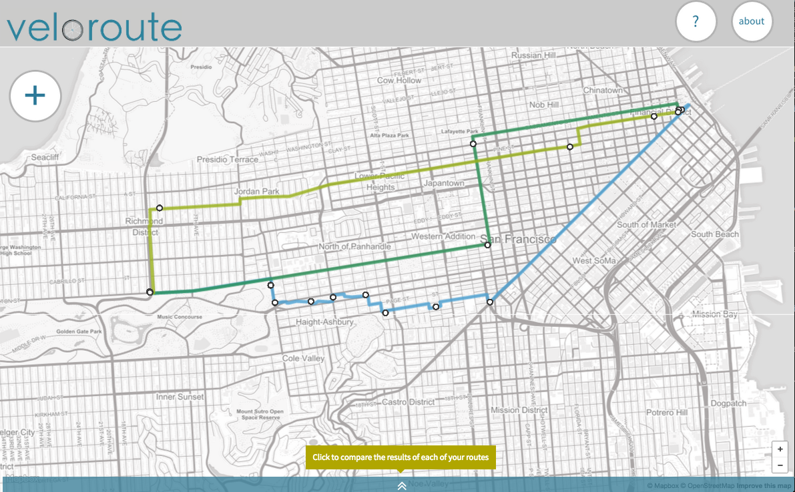
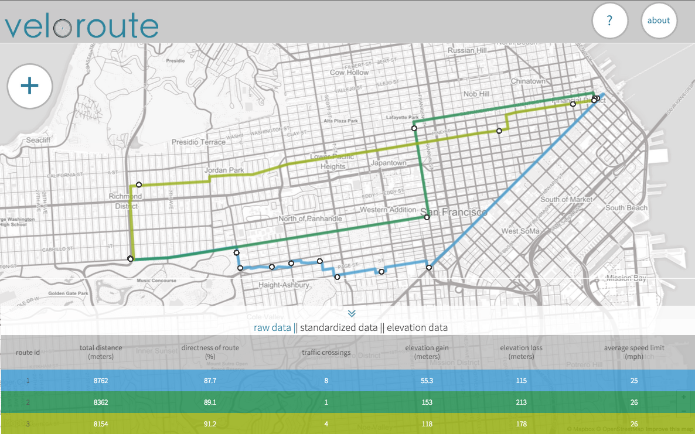
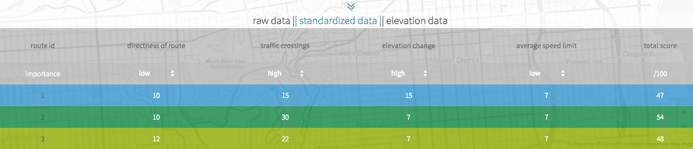
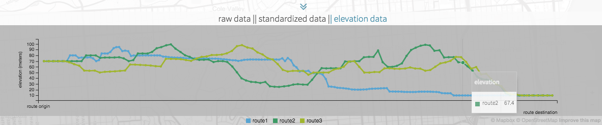

<br><br>

Veloroute is a tool that allows city enthusiasts to evaluate potential bike route alternatives. Veloroute aggregates data regarding distance, elevation, speed limits and required traffic crossings, from OpenStreetMap and the City of San Francisco. Users are able to score routes by weighting variables according to their personal perception of importance. Additionally, users can visualize route-specific elevation data. 
<br><br>

A deployed version of this project can be found at : https://veloroute.herokuapp.com/

<br><br>
<br><br>
<br><br>

<h4> Techonology Stack </h4>
__Backend__: Python, Flask, SQLAlchemy, SQLite <br>
__Frontend__: JavaScript, jQuery, HTML5, CSS3, Leaflet, Mapbox, C3 Charts <br>
__Testing__: Jasmine unit tests <br>
__APIs__: Mapbox Directions, Mapbox Surface
<br><br>

## Features

Users are able to add routes to be analayzed by drawing lines on a map. Users are able to view raw, standardized and elevation data for each of their routes.
<br>
The raw data tab displays distance, directness of route, traffic crossings, elevation and average speed limit data for each route.
<br><br>


<br>
The standardized data tab allows users to weight variables according to their preferences and view a weighted score for each route.
<br><br>

<br>
The elevation tab allows users to track a route's change in elevation from beginning to end.
<br><br>


## Setting Up

Clone or fork this repo: 

```
https://github.com/sbindman/HackbrightFinal.git

```

Install Python on your computer if you haven't yet.

```

sudo easy_install pip

sudo pip install virtualenv

```

Create and activate a virtual environment inside your project directory: 

```

virtualenv env

source env/bin/activate

```

Install the requirements:

```
pip install -r requirements.txt

```

Run the app:

```
python server.py

```
Navigate to `localhost:5000/` to draw your own bike routes!

<br>
<h4>File Structure</h4>

__server.py__ :  flask app <br>
__model.py__ : sql database which stores user data <br>
__apiModel.js__ : makes API requests to Mapbox <br>
__calculations.js__ : calculates route-specific data based on request responses <br>
__definitions.js__ : defines global variables and class constructors <br>
__displaydata.js__ : populates data tables <br>
__functionality.js__ : controls map capabilities including starting routes, ending routes and adding markers <br>
__pageActions.js__ : defines jquery functions and button events <br>
__calc-specs.js__ : outlines tests to be run in jasmine <br>

<br>
## Data Decisions
<h3> Raw Data </h3>
- __Distance__ : total distance is measured in meters. Once a user has completed a route for analysis, an API request is sent to Mapbox's directions API which includes the origin, destination and user-selected waypoints. This request returns total distance. 

- __Directness of route__ : directness of route is calculated by taking the ratio of the total distance of the proposed route and the most direct distance between origin and destination (this distance is calculated by passing the origin and destination in Mapbox's directions API). This variable is included because bike routes should be as direct as possible as riders are less likely to use routes which are out of the way. 

- __Traffic Crossings__ :the number of left turns along a route between origin and destination is used to approximate the number of difficult traffic crossings. This number is calculated by iterating over the directions returned from the Mapbox directions API and counting when the required direction is a left turn. This variable is included because left turns are particularly challenging on a bike as it requires crossing a number of lanes of traffic. As such, the number of left turns should be minimized. 

- __Elevation Gain & Loss__: elevation is measured in meters. Elevation data comes from the Mapbox surface API. Elevation is measured at frequent points along the proposed route. 

- __Average Speed Limit__ : speed limit data comes from the city of san francisco. Using Mapbox's surface API, I was able to upload speed limit data to Mapbox's platform and run data requests. It is safer for people to bicycle on roads with a lower speed limit and thus, roads with lower speed limits should be prioritized. The average speed limit along a route is calculated by requesting the speed limit at frequent intervals along a route and then calculating the average from that investigation. As this is a messy dataset, I made a number of assumptions regarding the data: streets that reported speeds less than 25 mph were assumed to be 25 mph (the san francisco standard for residential streets). Additionally, along route segments without speed limits (for example pedestrian paths) the speed limit was approximated at 10 mph. Speed limit data only exists within the city of san francisco.
<br><br>

<h3> Standardized Data</h3>
Standardized routes are given a score out of 100. Each variable is initaitely scored out of 25 points but can be adjusted according to a user's weight preferences. Variables are consistent with raw data except elevation is condensed into a single variable which represents the total net elevation change. Scores were assigned to variables according to my best judgement and can be updated in my code in definitions.Js. Standardized data cutoffs are as follows:

| Variable           |5 points |10 points|15 points |20 points |25 points|
| -------------      |:-------:|:-------:|:--------:|:--------:|--------:|
| Directness (%)     |67 - 71  |71 - 77  |77 - 83   |83 - 91   |91 - 100 |
| Crossings (#)      | > 10	   |6-10     |3-6	    |1-3	   |0        |
| Elevation (meters) |> 200    |150 - 200|100 - 150 |50 - 100  |< 50     |
| Average Speed (mph)|> 29     |27 - 29  |25 - 27   |20 - 25  |< 20      |


<br>
<h3> Elevation Data </h3>

Elevation data is charted using the C3 library.  The chart displays the change in elevation from origin to destination along a proposed route regardless of total distance.

## License

[MIT License](http://www.opensource.org/licenses/mit-license.php)

Copyright (c) 2015 Sarah Bindman

Permission is hereby granted, free of charge, to any person obtaining a copy of this software and associated documentation files (the "Software"), to deal in the Software without restriction, including without limitation the rights to use, copy, modify, merge, publish, distribute, sublicense, and/or sell copies of the Software, and to permit persons to whom the Software is furnished to do so, subject to the following conditions:

The above copyright notice and this permission notice shall be included in all copies or substantial portions of the Software.

THE SOFTWARE IS PROVIDED "AS IS", WITHOUT WARRANTY OF ANY KIND, EXPRESS OR IMPLIED, INCLUDING BUT NOT LIMITED TO THE WARRANTIES OF MERCHANTABILITY, FITNESS FOR A PARTICULAR PURPOSE AND NONINFRINGEMENT. IN NO EVENT SHALL THE AUTHORS OR COPYRIGHT HOLDERS BE LIABLE FOR ANY CLAIM, DAMAGES OR OTHER LIABILITY, WHETHER IN AN ACTION OF CONTRACT, TORT OR OTHERWISE, ARISING FROM, OUT OF OR IN CONNECTION WITH THE SOFTWARE OR THE USE OR OTHER DEALINGS IN THE SOFTWARE.
